# Investor Bulletin Project


> 🚨 This project doesn’t cover all tech/tools in Malaa stack and is only meant to give the initial boost and confidence to start working on Malaa’s codebase
>
## Objectives

You will create a simple API using FastAPI (python web framework), events published & consumed through RabbitMQ, and background tasks managed by Celery to sync stock market data and provide threshold alerting based on user interests.

## Project Context

Stock investments provide one of the highest returns in the market. Even though they are volatile in nature, one can visualize share prices and other statistical factors, which helps keen investors carefully decide on which company they want to spend their earnings on.

This project will allow users to retrieve the latest stock market prices and create alert rules by setting a threshold price for the stock they are interested in and receiving alerts if stocks cross those thresholds.

## High-Level Approach

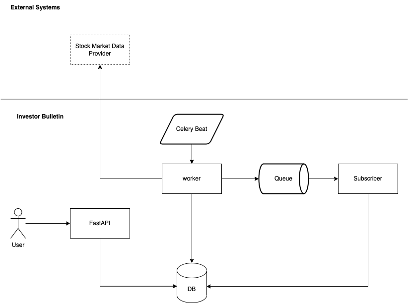

## Project phases

- [Phase One - Getting to know FastAPI](./phase_1/README.md)
- [Phase Two - Creating Publisher and Subscriber](./phase_2/README.md)
- [Phase Three - Background tasks](./phase_3/README.md)

## Using Docker Setup

You can make your own setup / but to speed you up, you can use the provided setup. Just ensure you have the docker installed and the docker-compose, then run `make up` to start the containers.

## Deliverables

The solution should be submitted by phase as a GitHub repository with the following:

- Source code with clear comments and documentation.
- Instructions on how to run the code.
- A brief explanation of the solution and any trade-offs made.
## Evaluation

The solution will be evaluated based on the following criteria:

- Code quality and engineering practices.
- Documentation and comments.
- Ease of setup and configuration.
- Solution architecture and design decisions.
- Adherence to the requirements.

## Prerequisites
  - Create an account and subscribe to Twelvedata API
  - docker and docker-compose installed

## Environment Variables

To run this project, you will need to add the following environment variables to your .env file

`RAPIDAPI_KEY`

`RAPIDAPI_HOST`


## Run Locally

Clone the project

```bash
git clone https://github.com/mhalsaiari/investor-bulletin-main.git
```

Go to the project directory

```bash
cd investor-bulletin-main
```

Move .env.example to .env

```bash
mv .env.example .env
```

Add environment variables to your .env

```bash
RAPIDAPI_KEY=
RAPIDAPI_HOST=
```

Run Application

```bash
make up
```

To stop application
```bash
make down
```

## View worker and Event subscriber logs
``` bash
docker logs -f worker-server
docker logs -f subscriber-server
```


## Applications urls


| Name                 | URL                                        |
| -------------------- | ------------------------------------------ |
| CockroachDB Admin UI | http://localhost:8080                      |
| RabbitMQ Management  | http://localhost:15672 (user: guest/guest) |
| FastAPI Docs         | http://localhost:8000/docs                 |


## API Reference


### Market Prices

| Method | Endpoint          | Description                     | Parameters |
|--------|-------------------|---------------------------------|------------|
| `GET`  | `/market-prices`  | Get latest market prices        | None       |

---

### Alert Rules

| Method   | Endpoint                  | Description                     | Parameters                              |
|----------|---------------------------|---------------------------------|-----------------------------------------|
| `POST`   | `/alert-rules`            | Create new price alert rule     | **Body**:<br>- `name` (string)<br>- `threshold_price` (number)<br>- `symbol` (string) |
| `GET`    | `/alert-rules`            | List all alert rules            | None                                    |
| `PATCH`  | `/alert-rules/{id}`       | Update specific alert rule      | **Path**:<br>- `id` (integer)<br>**Body**:<br>- Any updatable fields |
| `DELETE` | `/alert-rules/{id}`       | Delete alert rule               | **Path**:<br>- `id` (integer)           |

---

### Alerts

| Method | Endpoint    | Description                     | Parameters |
|--------|-------------|---------------------------------|------------|
| `GET`  | `/alerts`   | List all triggered alerts       | None       |

---

## Screenshots
### Run application
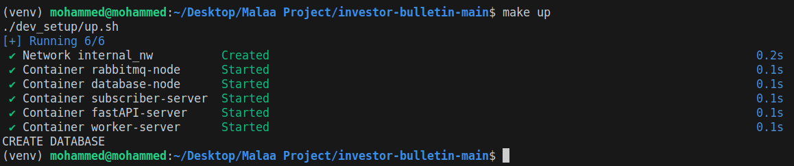
### worker
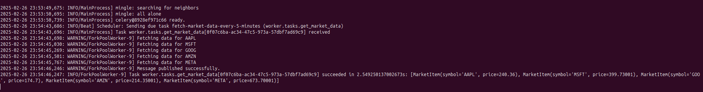
### cockroach
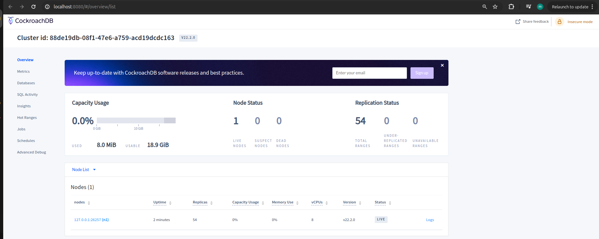
### exchanges
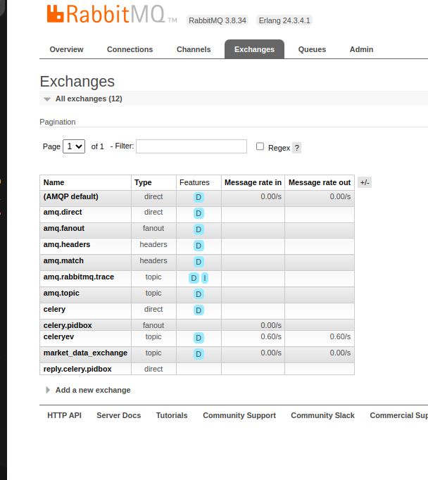
### queues
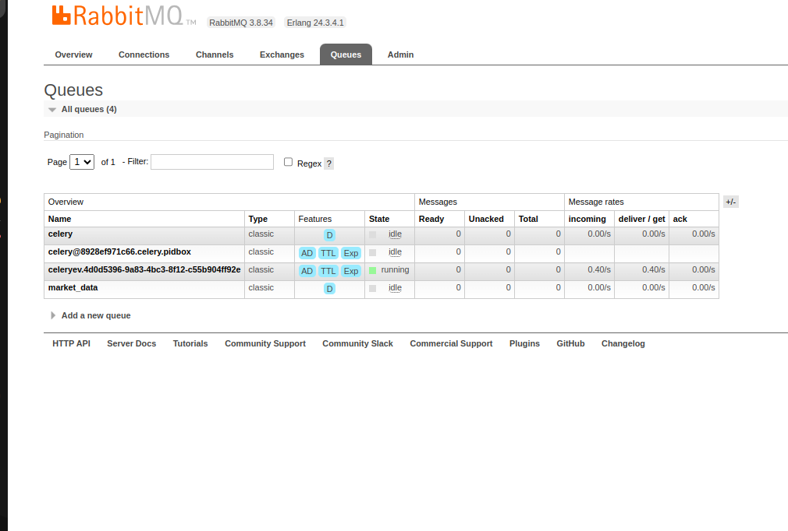
### fastAPI
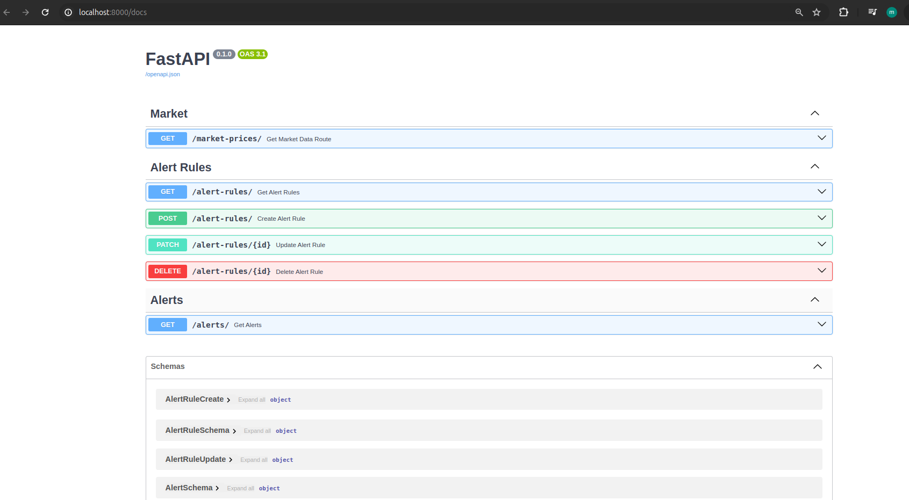
### Event consumer
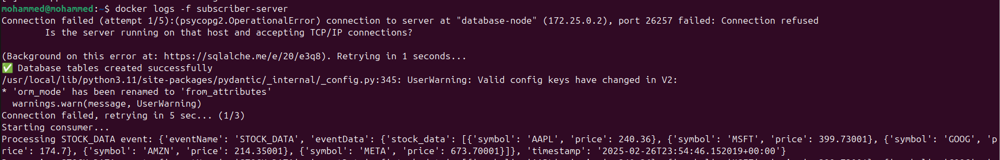
### create alert rule
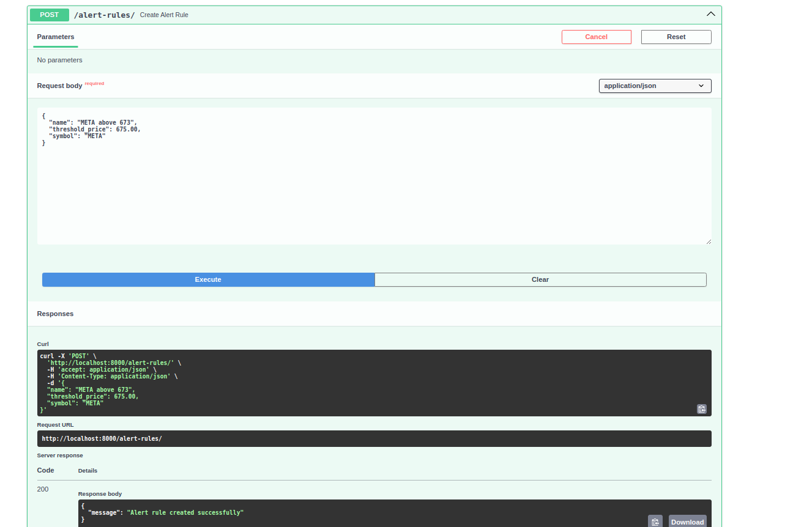
### Notify user
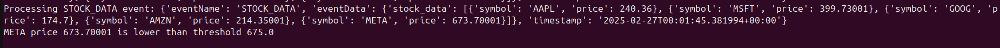
### get user alerts
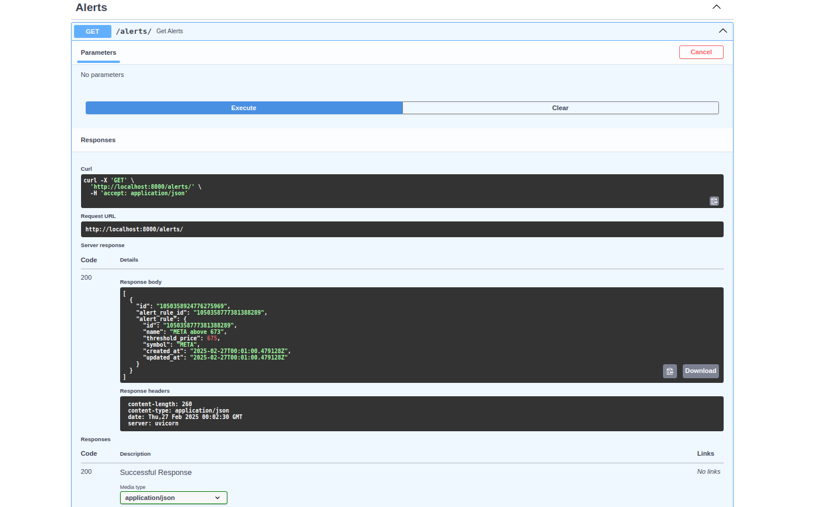
