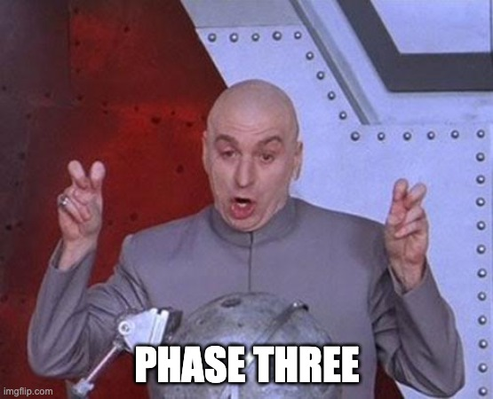

# PHASE Tow (Background tasks)

## Technology used

> 📢📢📢 please use `Topic Exchange` as your message routing agents [for more info](https://www.cloudamqp.com/blog/part4-rabbitmq-for-beginners-exchanges-routing-keys-bindings.html)

* Background task - [Celery](https://docs.celeryq.dev/en/stable/getting-started/first-steps-with-celery.html)
* Schedular - [celery beat](https://docs.celeryq.dev/en/stable/userguide/periodic-tasks.html)
* Publisher - [amqpstorm](https://www.amqpstorm.io/examples/simple_publisher.html)
* Broker [RabbitMQ](https://www.rabbitmq.com/tutorials/tutorial-one-python.html)

## Objectives

to be able to sync the market data periodically every hour and publish the data into a queue

## Functionality

* Background task to fetch market data for symbols mentioned in phase one

* publish event for each symbol synced with the new price

* schedule to trigger the task every hour

## TASKS Breakdown

- [✅] **Copy all your work in phase one**
- [✅] **Set up your environment**
 Whether on your machine or using docker, make sure you have a running rabbitmq broker
- [✅] **Configure Celery app**

- [✅] **Create a celery task that use the market_service.py to sync the market data**
- [✅] **Get to know Rabbitmq and Configure the queues**
- [✅] **Create a publisher connection using amqpstorm inside the core/messaging.py file**
- [✅] **Inside the celery publish `STOCK_DATA` event**
- [✅] **Run the celery worker and make sure everything is working and the check the if the queue has already field with data**
- [✅] **create a celery beat that runs the task every 5 min**

## What's next

* **If you complete the tasks**, just reply back, tell us more about your comfort level out of 5 and what was the most challenging part and the most rewarding part.
--

* **If you stuck, or it took so long** it ok, we understand just replay back with your work, tell us more about your comfort level out of 5 and how much did you actually completed from the task out of 7, where are you stuck or what took the most of your time
