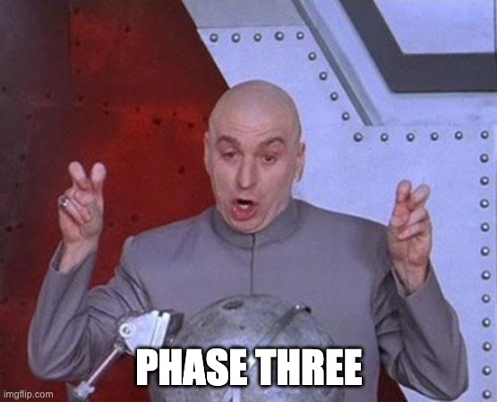

# PHASE THREE (Creating publisher/Subscriber)

## Technology used

- Subscriber - [Pika](https://pika.readthedocs.io/en/stable/intro.html)

## Objectives

consume the stocks data queue and print the result of that event and check if any of any of the stocks crossed those thresholds that was sets by the users in our rules table and create a new event to alert the user based on that

## Functionality

- **Consume the `STOCK_DATA` event and check if any of any of the stocks crossed those thresholds print the message aka the alert**

## TASKS Breakdown

- [ ] **Copy all your work in phase two**

- [ ] **Create a consumer connection using pika inside the event_subscriber/main.py**
- [ ] **Consumed the published event and print the message by running the the event_subscriber/main.py**
- [ ] **Create an event record by using the alert_service.py**

## What's next

* **If you complete the tasks**, just reply back, tell us more about your comfort level out of 5 and what was the most challenging part and the most rewarding part.
--

* **If you stuck, or it took so long** it ok, we understand just replay back with your work, tell us more about your comfort level out of 5 and how much did you actually completed from the task out of 7, where are you stuck or what took the most of your time
